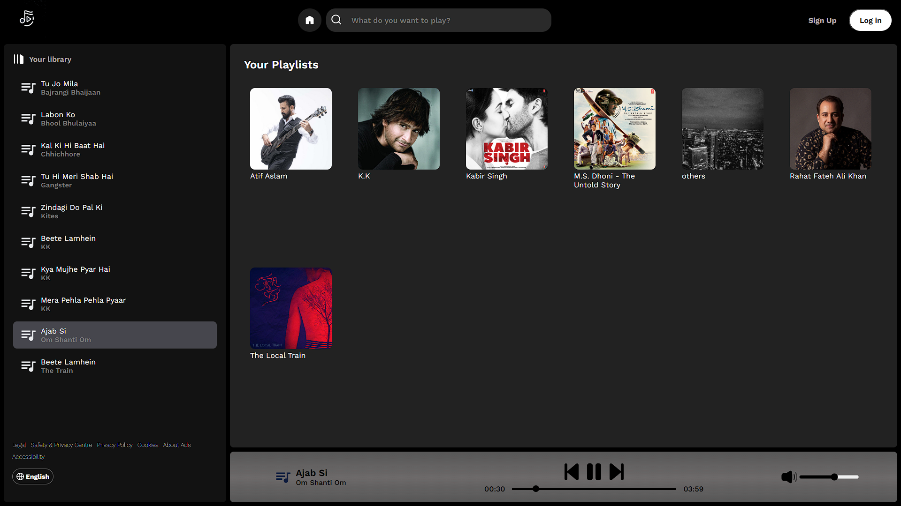

# Harmoniq - Music Player

Harmoniq is a web-based music player that allows users to browse and play songs stored locally. It provides a responsive and user-friendly interface for desktop, tablet, and mobile devices.

## User Interface

Below is a preview of the application's user interface:

## Features

- **Fetch Songs from Local Storage**: The application dynamically fetches songs and their metadata (e.g., cover images, song names) from a local directory.
- **Responsive Design**: The layout adapts seamlessly to different screen sizes, including tablets and mobile devices. Check `responsive.css` for details.
- **Interactive Playbar**: Users can drag the playbar to adjust the current playback time of the song.
- **Volume Control**: Users can adjust the volume using a slider or mute/unmute the audio.
- **Playlist Management**: Displays playlists with album covers and allows users to select and play songs from a specific playlist.
- **Mobile Navigation**: Includes a hamburger menu for easy navigation on smaller screens.

## Project Structure

The project is organized as follows:

- **index.html**: The main HTML file that structures the application layout, including navigation, playlists, and the playbar.
- **CSS**:
  - `style.css`: Contains the primary styles for the application, including layout and design for desktop screens.
  - `responsive.css`: Contains media queries and styles for tablet and mobile responsiveness.
  - `utility.css`: (if present) Includes reusable utility classes for styling.
- **JavaScript**:
  - `script.js`: Contains the core logic for fetching songs, managing playlists, handling playback controls, and adding interactivity.
- **Assets**:
  - `assests/images/`: Stores images such as icons, logos, and album covers.
  - `public/songs/`: Stores the local songs and their respective folders.
- **favicon.ico**: The favicon for the application.

## How It Works

1. **Fetching Songs**: The application fetches songs and album data from the `public/songs/` directory using JavaScript's `fetch` API.
2. **Dynamic Rendering**: Songs and playlists are dynamically rendered in the UI based on the fetched data.
3. **Playback Controls**: Users can play, pause, skip, or go back to previous songs. The playbar and volume slider provide additional controls.
4. **Responsive Design**: The layout adjusts based on the screen size, ensuring a smooth experience on all devices.

## Notes

- Ensure that the `public/songs/` directory contains properly structured folders with `.mp3` files and corresponding `cover.jpg` images for albums.
- The application uses relative paths for fetching resources, so it should be run in a local server environment to avoid CORS issues.
- For mobile users, the hamburger menu and cross button allow toggling the left navigation box.

Feel free to explore and enhance the project further!
